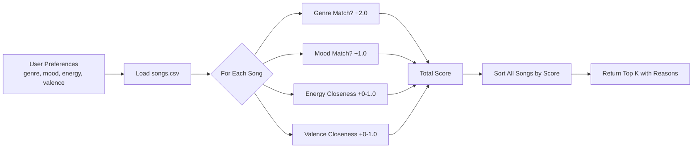
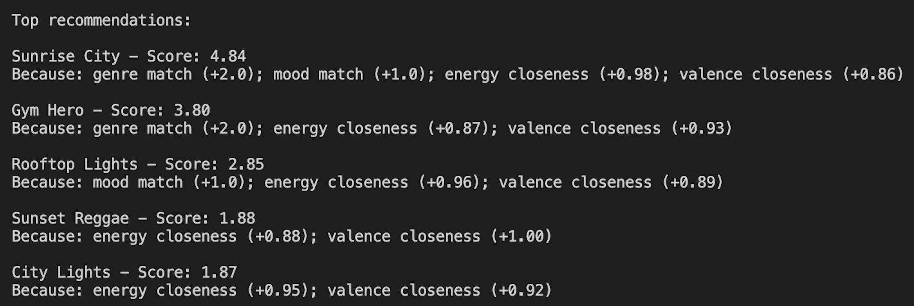

# 🎵 Music Recommender Simulation

## Project Summary

In this project you will build and explain a small music recommender system.

Your goal is to:

- Represent songs and a user "taste profile" as data
- Design a scoring rule that turns that data into recommendations
- Evaluate what your system gets right and wrong
- Reflect on how this mirrors real world AI recommenders

This version builds a content-based music recommender in Python that scores songs from a small CSV catalog against a user taste profile. It uses genre, mood, and audio features like energy and valence to calculate a weighted relevance score for each song, then returns the top-ranked results with plain-language explanations for why each song was recommended.

---

## How The System Works

Explain your design in plain language.

Some prompts to answer:

- What features does each `Song` use in your system
  - For example: genre, mood, energy, tempo
- What information does your `UserProfile` store
- How does your `Recommender` compute a score for each song
- How do you choose which songs to recommend

You can include a simple diagram or bullet list if helpful.

Platforms like Spotify and YouTube use two main approaches to suggest music. Collaborative filtering looks at what thousands of other users with similar listening habits enjoyed, while content-based filtering analyzes the actual attributes of songs — like genre, mood, and energy — and matches them to what a specific user tends to like. Real systems typically blend both methods, but for this simulation, we focus on content-based filtering because it works even without large amounts of user interaction data and produces explainable, interpretable results.

This system prioritizes musical "vibe" matching — finding songs that feel right for a user based on measurable audio attributes and categorical labels. Rather than relying on what other users listened to, every recommendation is driven entirely by how closely a song's features align with the user's stated preferences.

### Song Features
Each `Song` object uses the following attributes from `songs.csv`:

- `genre` — categorical (e.g., pop, rock, lofi)
- `mood` — categorical (e.g., happy, chill, intense)
- `energy` — float 0.0–1.0 (how high-energy the track feels)
- `valence` — float 0.0–1.0 (musical positivity/happiness)
- `danceability` — float 0.0–1.0
- `acousticness` — float 0.0–1.0
- `tempo_bpm` — numeric (beats per minute)

### UserProfile Features

The `UserProfile` stores the user's target preferences:

- `favorite_genre` — the genre the user wants to match
- `favorite_mood` — the mood the user prefers
- `target_energy` — their ideal energy level (0.0–1.0)
- `target_valence` — their ideal positivity level (0.0–1.0)

### Scoring a Song

The recommender scores each song by comparing it to the user profile using this recipe:

- **+2.0 points** if the song's genre matches `favorite_genre`
- **+1.0 point** if the song's mood matches `favorite_mood`
- **Up to +1.0 point** based on how close the song's energy is to `target_energy`, using `1.0 - abs(song.energy - target_energy)`
- **Up to +1.0 point** for a similar closeness score for `valence`

### Choosing Recommendations
Every song in the catalog is scored individually, then the full list is sorted from highest to lowest score. The top *k* songs (default: 5) are returned as recommendations, along with the specific reasons each song earned its score so the output is transparent and explainable.

### System Flowchart


---

## Getting Started

### Setup

1. Create a virtual environment (optional but recommended):

   ```bash
   python -m venv .venv
   source .venv/bin/activate      # Mac or Linux
   .venv\Scripts\activate         # Windows

2. Install dependencies

```bash
pip install -r requirements.txt
```

3. Run the app:

```bash
python -m src.main
```

### Running Tests

Run the starter tests with:

```bash
pytest
```

You can add more tests in `tests/test_recommender.py`.

---
## Algorithm Recipe

The scoring logic used by this recommender:

- **+2.0 points** — genre matches `favorite_genre`
- **+1.0 point** — mood matches `favorite_mood`
- **+0.0 to 1.0** — energy closeness: `1.0 - abs(song.energy - target_energy)`
- **+0.0 to 1.0** — valence closeness: `1.0 - abs(song.valence - target_valence)`
- **+0.0 to 0.5** — danceability closeness: `0.5 * (1.0 - abs(song.danceability - target_danceability))`
- **+0.0 to 0.5** — acousticness closeness: `0.5 * (1.0 - abs(song.acousticness - target_acousticness))`

**Max possible score: 6.0**

### Expected Bias
This system may over-prioritize genre since it carries the most weight (+2.0). A song with a perfect genre match but mismatched mood and energy can still outscore a song with no genre match but perfect audio alignment. The dataset may also skew results if one genre appears more frequently than others.

---

## Experiments You Tried

Use this section to document the experiments you ran. For example:

- What happened when you changed the weight on genre from 2.0 to 0.5
- What happened when you added tempo or valence to the score
- How did your system behave for different types of users

### Terminal Output — Default Profile (Pop / Happy)



### Algorithm Recipe

The scoring logic in `recommender.py` awards points as follows:

- **+2.0** for a genre match (`favorite_genre`)
- **+1.0** for a mood match (`favorite_mood`)
- **+0.0 to +1.0** for energy closeness: `1.0 - abs(song_energy - target_energy)`
- **+0.0 to +1.0** for valence closeness: `1.0 - abs(song_valence - target_valence)`

Maximum possible score: **5.0**

### Potential Bias Note

This system may over-prioritize genre since it carries the highest weight (+2.0). A song with a perfect genre match but mismatched mood and energy could still outrank a song that matches mood, energy, and valence closely. The dataset size also limits variety — if most songs share one genre, that genre will dominate results across all user profiles.

---

## Limitations and Risks

Summarize some limitations of your recommender.

Examples:

- It only works on a tiny catalog
- It does not understand lyrics or language
- It might over favor one genre or mood

You will go deeper on this in your model card.

- The catalog is small, so results can feel repetitive across different user profiles
- Genre carries the most weight (+2.0), which may cause great mood/energy matches to get buried if their genre doesn't match
- If the dataset has more pop songs than any other genre, pop will dominate recommendations regardless of audio features
- The system has no memory — it treats every run as if it's meeting the user for the first time
- It cannot understand lyrics, language, or cultural context

---

## Reflection

Read and complete `model_card.md`:

[**Model Card**](model_card.md)

Write 1 to 2 paragraphs here about what you learned:

- about how recommenders turn data into predictions
- about where bias or unfairness could show up in systems like this


---
